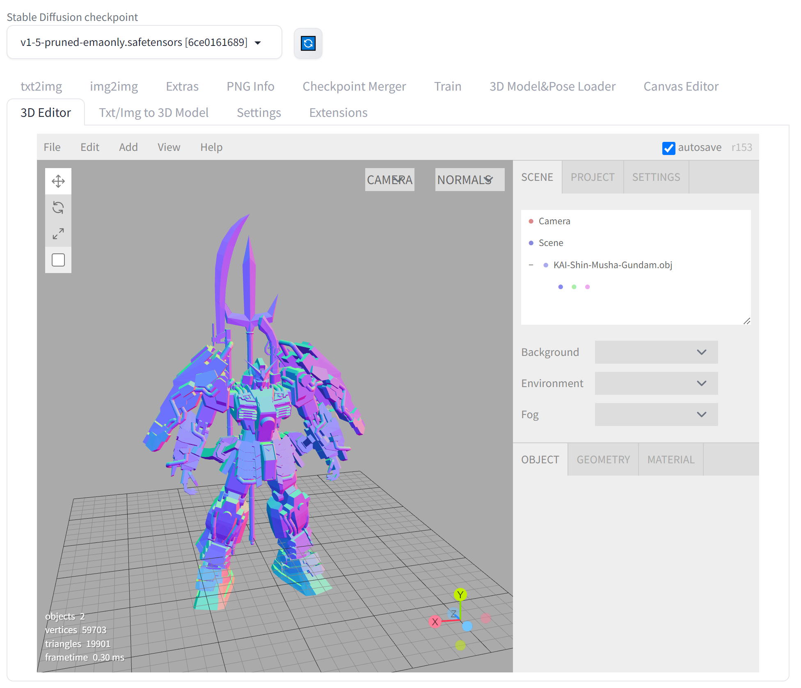
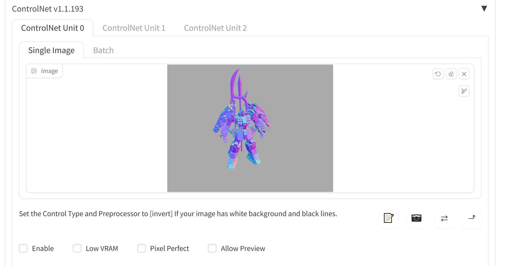

# Stable Diffusion WebUI 3D Editor
A custom extension for [AUTOMATIC1111/stable-diffusion-webui](https://github.com/AUTOMATIC1111/stable-diffusion-webui) that with 3D modeling features (add/edit basic elements, load your custom model, modify scene and so on), then send screenshot to txt2img or img2img as your ControlNet's reference image, basing on [ThreeJS editor](https://github.com/mrdoob/three.js/tree/master/editor)  

## About ThreeJS and ThreeJS Editor
Please refer to [ThreeJS](https://threejs.org/) and [ThreeJS Editor](https://threejs.org/editor/) for more information. 

## Features
1. load your custom models
2. export model
3. add/edit basic elements
4. edit scene
5. send screenshot to ControlNet as reference image
6. more features

## Installation
Just like you install other extension of webui:
1. go to Extensions -> Install from URL
2. paste this repo link
3. install
4. go to Installed, apply and restart UI

## Known Issues
1. currently, you need to manual resize browser at the first time to show up the canvas (I will try to figure out the solution soon)

## Credits
Created by [jtydhr88](https://github.com/jtydhr88) and basing on [ThreeJS editor](https://github.com/mrdoob/three.js/tree/master/editor)

## My other extension for Stable diffusion webui
- [3D Model/pose loader](https://github.com/jtydhr88/sd-3dmodel-loader) A custom extension for AUTOMATIC1111/stable-diffusion-webui that allows you to load your local 3D model/animation inside webui, or edit pose as well, then send screenshot to txt2img or img2img as your ControlNet's reference image.
- [Canvas Editor](https://github.com/jtydhr88/sd-canvas-editor) A custom extension for AUTOMATIC1111/stable-diffusion-webui that integrated a full capability canvas editor which you can use layer, text, image, elements and so on, then send to ControlNet, basing on Polotno.
- [StableStudio Adapter](https://github.com/jtydhr88/sd-webui-StableStudio) A custom extension for AUTOMATIC1111/stable-diffusion-webui to extend rest APIs to do some local operations, using in StableStudio.
- [Txt/Img to 3D Model](https://github.com/jtydhr88/sd-webui-txt-img-to-3d-model) A custom extension for sd-webui that allow you to generate 3D model from txt or image, basing on OpenAI Shap-E.